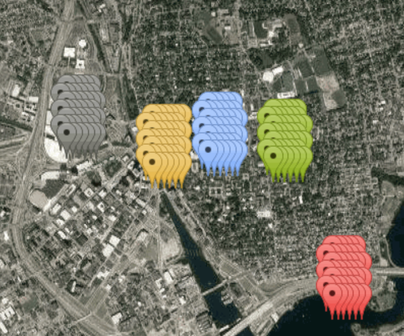

# ARrg photos
Hack@Brown 2018 Submission

ARrg photos is an exploration of viewing images in AR, comprised of two smaller projects, TourAR and Egg.

## Team members:

+ [Gabriela Asuncion](https://github.com/gabbyasuncion)
+ [Zhizhong (Isaac) Chen](https://github.com/isaacvictor)
+ [Jessica Cheng](https://github.com/jlcheng29)
+ [Nomin Khishigsuren](https://github.com/nkhishig)
+ [Juan David Lizarazo](https://github.com/juandlizarazo/)

## TourAR

### About
TourAR allows users to walk through Providence in a new way.  It maps images from four locations in Providence (Downtown, RISD, Main Green, and Barus and Holley) into arrays of images spread in a 3D space the size of Sayles Hall.
### Process
We created TourAR using Google Streetview API, Google Static Maps API, Three.js, coding on Python, Javascript, and Mathematica.

Using Python we looped through different latitude and longitude values and which we set as parameters in requests to Google Streetview API. The images returned by the request were saved and used in the AR. We plotted the positions of each image as markers on a satellite map using Google Static Maps API.

For using webAR we first tried hard to understand the examples that were given to us. Then we tried rendering a single image (image.html), and this we found we could simply do by rendering a mesh with a texture taken from the image. After that we tried putting a panel (panel 16.html). After that we put in little groups for the four points of interest. And finally we found it cool if above each group we had a little title for the region being looked at. Oh, and we also randomized the positions of the images so that they would look more artsy!

## Egg
### About
Our city tour didn't make webAR stutter so we decided to test a bit more its limits. We wanted to see how many images we could render. If we tried rendering 2048 images 500 x 500 px, it just refused to do it. Then we decided to render just single color tiles, 2048 of them, in a little swarm, in which center a special image was to be found! Like a treasure hunt! Look at egg.html to see our code. To render the cloud of points we used Mathematica to render a distribution whose density increased towards the special point of interest, and carved a little sphere surrounding it so that the special image would feature well.

